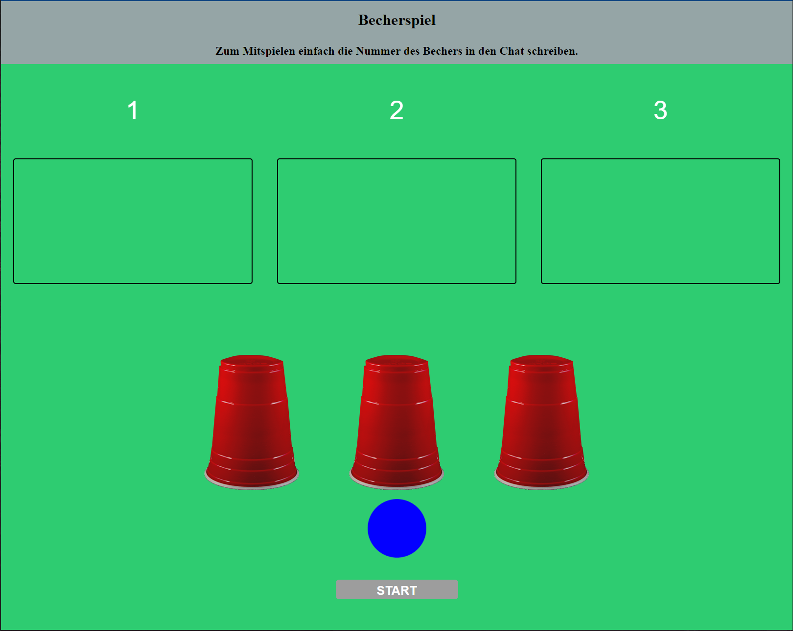
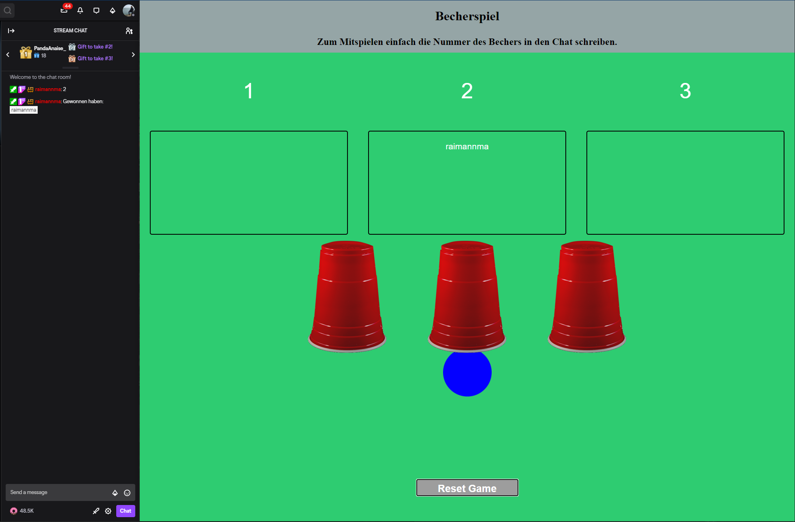

# Twitch Minigames

## Get started

1. Install Node js from here: [https://nodejs.org/](https://nodejs.org/)
2. Clone this repo or download it as zip, by clicking the green download button at the right top.
3. Open command line and cd into the repo folder
4. Run `npm install`
5. Run `npm start`
6. It should build the the code and should show something like this: `Server running at http://0.0.0.0:3000/`
7. Open the browser at `localhost:3000` and you are done!

## Cup Game

  
